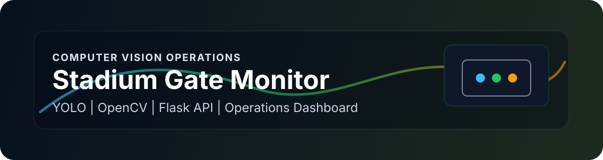
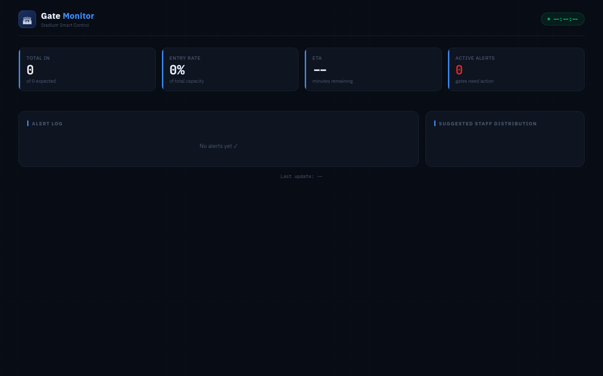

<p align="center">
  
</p>

# Stadium Gate Monitor

[](https://github.com/Abdulel3h/Stadium/actions/workflows/ci.yml)

Computer-vision prototype for monitoring stadium gate occupancy, crowding, alerts, and staff distribution.

## Overview

This project uses YOLO object detection with OpenCV and a Flask status API to estimate people counts across predefined stadium gate zones. A separate dashboard reads the API and displays gate status, occupancy, ETA, alerts, and recommended staff distribution.

## Documentation

- [Architecture](docs/architecture.md)
- [Case Study](docs/case-study.md)
- [Engineering Principles](docs/engineering-principles.md)
- [Technical Decisions](docs/technical-decisions.md)
- [Reviewer Guide](docs/reviewer-guide.md)
- [Testing and CI](docs/testing.md)

## Features

- YOLO-based person detection and tracking
- Four configurable gate zones
- Occupancy and crowding detection
- Gate status states: normal, busy, critical, overflow
- Alert log for crowding and overflow
- Staff distribution recommendation based on load
- Flask API endpoints for status and health
- HTML dashboard that polls live gate status

## Architecture

```text
Video source or webcam
  -> YOLO person detection
  -> gate zone assignment
  -> DecisionEngine status and alert logic
  -> Flask /api/status
  -> dashboard.html live monitor
```

## Tech Stack

- Python
- OpenCV
- Ultralytics YOLO
- Flask
- Flask-CORS
- NumPy
- HTML, CSS, JavaScript

## Installation

```bash
python -m venv .venv
. .venv/Scripts/activate
pip install -r requirements.txt
python stadium_system.py
```

Optional local environment:

```bash
ALLOWED_ORIGINS=http://localhost:5000,http://127.0.0.1:5000
```

The API starts at `http://localhost:5000/api/status`. The OpenCV window displays the processed video.

## Usage

- Change `VIDEO_SOURCE` in `stadium_system.py` to a local scenario file or `0` for webcam.
- Open `dashboard.html` in a browser while the Flask API is running.
- Press `q` in the OpenCV window to quit the vision loop.

## Screenshots



Captured from the committed dashboard HTML. Add YOLO overlay captures from the scenario videos after the vision loop is calibrated.

## System Design

- `GateState` tracks count, capacity, crowding incidents, entry rate, status, alert, and redirect target.
- `DecisionEngine` updates all gates, assigns status, logs alerts, estimates ETA, and recommends staff.
- `run_vision()` performs YOLO detection and maps person centroids into gate zones.
- `dashboard.html` polls `/api/status` every two seconds.

## Folder Structure

```text
stadium_system.py     Vision loop, gate logic, Flask API
dashboard.html        Live status dashboard
scenario*.mp4         Local video scenarios
yolo*.pt              YOLO model files
شرح.md               Arabic project notes and setup explanation
```

## Challenges

- Gate zones are hard-coded and need calibration for each camera angle.
- The system depends on local model/video files that make the repository large.
- No automated tests currently validate counting, alert thresholds, or API schema.
- Real deployment would require camera privacy, latency, and operations review.

## Future Work

- Move gate definitions to a configuration file.
- Add YOLO overlay screenshots and a short demo video.
- Add tests for `DecisionEngine` status transitions and API responses.
- Add Docker instructions for repeatable setup.
- Document camera placement assumptions and privacy constraints.

## License

No license file is currently present. All rights are reserved by default unless a license is added.

## Author

Abdulelah Alkhathami

## Contact

- Website: [abdulelah.de](https://www.abdulelah.de)
- GitHub: [Abdulel3h](https://github.com/Abdulel3h)
