<picture>
  <source media="(max-width: 600px)" srcset="assets/branding/hero-mobile.svg">
  
</picture>

# Stadium Gate Monitor

A computer-vision prototype that watches stadium gate zones, estimates how many people are at each gate, and turns that into an operational status a control room could act on.

**Status: prototype.** It runs against local video files or a webcam with hard-coded gate zones. It has not been calibrated against a real venue, and no accuracy measurement is claimed.

## Problem

Crowding at an entrance becomes a safety problem before anyone has counted it. Gate staff see their own queue, not the whole picture, and the decision that matters — move staff, redirect arrivals — depends on comparing gates against each other in the moment.

## Solution

The system detects people in a video stream, assigns each detection to one of four configured gate zones, and runs the counts through a decision engine that produces a status, an alert log, an ETA estimate and a recommended staff distribution. A dashboard polls that state so the operational picture stays current.

## How it works

1. **Detect.** YOLO finds people in each frame from a video file or webcam.
2. **Place.** Each detection's centroid is mapped into one of the four configured gate zones.
3. **Decide.** `DecisionEngine` updates every gate, assigns a status — normal, busy, critical or overflow — logs crowding and overflow alerts, estimates ETA and recommends where staff should go.
4. **Serve.** A Flask API exposes the current state at `/api/status`.
5. **Show.** `dashboard.html` polls that endpoint every two seconds and renders the gate board.

## Architecture

```text
Video source or webcam
  -> YOLO person detection
  -> gate zone assignment
  -> DecisionEngine status and alert logic
  -> Flask /api/status
  -> dashboard.html live monitor
```

| Component | Responsibility |
|---|---|
| `GateState` | Count, capacity, crowding incidents, entry rate, status, alert and redirect target |
| `DecisionEngine` | Updates all gates, assigns status, logs alerts, estimates ETA, recommends staff |
| `run_vision()` | YOLO detection and centroid-to-zone mapping |
| `dashboard.html` | Polls `/api/status` and renders the live board |

## Verified capabilities

Implemented and readable in `stadium_system.py`; none is a measured accuracy result.

- YOLO-based person detection across four configurable gate zones
- Occupancy and crowding detection with four status states
- Alert log for crowding and overflow events
- Staff distribution recommendation derived from relative load
- Flask status and health endpoints
- HTML dashboard polling live gate status

## Screenshot


Captured from the committed dashboard HTML.

## Tech stack

Python · OpenCV · Ultralytics YOLO · Flask

## Quick start

```bash
python -m venv .venv
. .venv/Scripts/activate
pip install ultralytics opencv-python flask flask-cors numpy
python stadium_system.py
```

The API starts at `http://localhost:5000/api/status` and an OpenCV window shows the processed video.

- Change `VIDEO_SOURCE` in `stadium_system.py` to a local scenario file, or `0` for a webcam.
- Open `dashboard.html` in a browser while the Flask API is running.
- Press `q` in the OpenCV window to quit the vision loop.

Optional local environment:

```bash
ALLOWED_ORIGINS=http://localhost:5000,http://127.0.0.1:5000
```

## Limitations

- **Zones are hard-coded.** Gate regions need calibration for every camera angle; they are not configuration-driven yet.
- **Untested logic.** No automated tests validate counting, alert thresholds or the API schema.
- **Repository weight.** Local model and video files make the repository large.
- **Not deployment-ready.** A real installation would need camera privacy, latency and operations review.

## Repository structure

```text
stadium_system.py     Vision loop, gate logic, Flask API
dashboard.html        Live status dashboard
scenario*.mp4         Local video scenarios
yolo*.pt              YOLO model files
شرح.md                Arabic project notes and setup explanation
```

## Documentation

[Architecture](docs/architecture.md) · [Case study](docs/case-study.md) · [Engineering principles](docs/engineering-principles.md) · [Technical decisions](docs/technical-decisions.md) · [Reviewer guide](docs/reviewer-guide.md) · [Branding assets](assets/branding/README.md)

## License

No license file is currently present. All rights are reserved by default unless a license is added.

## Contact

**Abdulelah Alkhathami** · [Portfolio](https://abdulelah.de) · [GitHub](https://github.com/Abdulel3h) · [Email](mailto:me@abdulelah.de)
