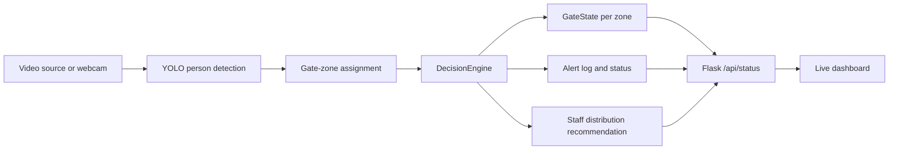

# Stadium Gate Monitor Architecture

Stadium Gate Monitor is a computer-vision operations prototype for estimating gate occupancy, crowding, alerts, and staff distribution.

## System Flow

## Key Design Decisions

- Keep gate zones explicit so reviewers can understand the counting logic.
- Separate detection from status decisions through `DecisionEngine`.
- Provide a dashboard API so operations state can be consumed independently from the OpenCV window.
- Treat videos and model files as local prototype assets, not production deployment dependencies.

## Production Gaps

- Move gate-zone definitions into configuration.
- Add tests for status transitions, crowding thresholds, and API responses.
- Document camera-placement assumptions and privacy constraints.
- Add deployment packaging and a lightweight demo mode.
